# Flujo metodológico VARX / VECMX

```mermaid
graph TD
    A["Selección y fundamentación teórica de variables"] --> B["Descarga y homologación de series SBS y BCRP"]
    B --> C["Depuración: faltantes, atípicos, quiebres estructurales y cambios metodológicos"]
    C --> D["Clasificación formal: endógenas Crédito/Mora; exógenas PBI/Tasa; dummies e intervenciones"]
    D --> E["Análisis gráfico, descriptivo, correlacional y ACF/PACF"]
    E --> F["Evaluación de estacionalidad: dummies mensuales y diagnóstico visual"]
    F --> G{"¿Existe estacionalidad relevante?"}

    G -- "Sí" --> H["Aplicar ajuste estacional justificable"]
    G -- "No" --> I["Mantener serie original"]

    H --> J["Pruebas de raíz unitaria en niveles: ADF y contraste complementario PP o KPSS"]
    I --> J

    J --> K{"¿Las series son estacionarias en niveles?"}

    K -- "Sí" --> L["Especificar VARX en niveles"]
    K -- "No" --> M["Aplicar transformación pertinente y primera diferencia"]

    M --> N["Reaplicar pruebas de raíz unitaria"]
    N --> O{"¿Las series diferenciadas son estacionarias?"}

    O -- "No" --> M
    O -- "Sí" --> P["Confirmar orden de integración: I uno"]

    P --> Q["Prueba de cointegración de Johansen entre variables endógenas"]
    Q --> R{"¿Las variables endógenas cointegran?"}

    R -- "Sí" --> S["Especificar VECMX con término de corrección de error"]
    R -- "No" --> T["Especificar VARX en primeras diferencias"]

    L --> U["Seleccionar rezagos: AIC, BIC, HQIC, parsimonia y tamaño muestral"]
    S --> U
    T --> U

    U --> V["Estimar el modelo: MCO para VARX o máxima verosimilitud para VECMX"]

    V --> W["Diagnóstico: estabilidad, Portmanteau o LM, ARCH-LM, normalidad Jarque-Bera y quiebres"]
    W --> X{"¿Modelo válido y estable?"}

    X -- "No" --> U
    X -- "Sí" --> Y["Pruebas de causalidad de Granger y evaluación de exogeneidad"]

    Y --> Z["Identificación de shocks: ordenamiento Cholesky fundamentado"]
    Z --> AA["Funciones impulso-respuesta, descomposición de varianza y bootstrap al 95 por ciento"]

    AA --> AB["Simulación de escenarios contrafactuales COVID-19 y evaluación de carteras"]
    AB --> AC["Validación predictiva fuera de muestra: RMSE, MAE, MAPE o Theil-U"]

    style A fill:#2c3e50,stroke:#1a252f,stroke-width:2px,color:#ffffff
    style AC fill:#2c3e50,stroke:#1a252f,stroke-width:2px,color:#ffffff

    style G fill:#f39c12,stroke:#d35400,stroke-width:2px,color:#ffffff
    style K fill:#f39c12,stroke:#d35400,stroke-width:2px,color:#ffffff
    style O fill:#f39c12,stroke:#d35400,stroke-width:2px,color:#ffffff
    style R fill:#f39c12,stroke:#d35400,stroke-width:2px,color:#ffffff
    style X fill:#f39c12,stroke:#d35400,stroke-width:2px,color:#ffffff
```



---

## Estructura de `src/` y decisiones de diseño

La carpeta `src/` sigue el mismo orden que el flujo metodológico anterior. Cada subdirectorio agrupa los archivos que corresponden a una etapa del pipeline, y cada archivo puede ejecutarse de forma independiente desde la CLI (`python src/<etapa>/<archivo>.py`) o ser invocado por la GUI mediante `subprocess`.

```
src/
├── config/
│   └── settings.py             # Parámetros globales: rutas, variables, horizonte
│
├── data/
│   ├── loader.py               # Carga y preparación de series (Excel → DataFrame)
│   └── cleaner.py              # Depuración: faltantes, atípicos, quiebres [stub]
│
├── descriptive/
│   ├── eda.py                  # Estadísticos, correlaciones, ACF/PACF [stub]
│   ├── plots.py                # Gráficos descriptivos de variables (2018–2022)
│   └── graph_2018_2022.py      # Gráfico comparativo período pandemia
│
├── seasonality/
│   └── seasonality.py          # Prueba F de dummies mensuales por variable
│
├── unit_roots/
│   └── unit_roots.py           # ADF, PP y KPSS en niveles y diferencias [stub]
│
├── cointegration/
│   └── johansen.py             # Prueba de Johansen para variables endógenas [stub]
│
├── model/
│   ├── lag_selection.py        # Tabla AIC / BIC / HQIC para selección de p
│   ├── varx.py                 # VARX con muestra completa (MCO ecuación a ecuación)
│   ├── varx_precovid.py        # VARX restringido a 2002-01 / 2020-02
│   └── vecmx.py                # VECMX con término ECT (ruta si hay cointegración) [stub]
│
├── diagnostics/
│   └── diagnostics.py          # Raíces de estabilidad, Ljung-Box, IRF bootstrap
│
├── causality/
│   └── granger.py              # Causalidad de Granger y exogeneidad débil [stub]
│
├── shocks/
│   ├── identification.py       # Descomposición de Cholesky (diag y completa) [stub]
│   ├── irf.py                  # Matrices IRF, ortogonalización y respuestas a shocks
│   ├── shock_pbi.py            # Shock macroeconómico (PBI observado vs baseline AR)
│   ├── plot_credit_bootstrap.py # IRF crédito con IC 95 % bootstrap por bloques
│   └── plot_mora_bootstrap.py  # IRF morosidad con IC 95 % bootstrap por bloques
│
├── scenarios/
│   ├── baseline.py             # Simulación sin COVID (exógenas AR, innovaciones = 0)
│   ├── counterfactual_covid.py # Inyección de innovaciones Mar/Abr 2020
│   ├── counterfactual_independent.py   # Escenario independiente (Sigma diagonal)
│   ├── counterfactual_not_independent.py # Escenario no-independiente (Sigma completa)
│   ├── escenarios_macro.py     # Shock PBI + shock financiero k=2 (tres escenarios)
│   ├── plots_escenarios.py     # Gráficos de escenarios vs observado
│   ├── plot_credit_levels.py   # Niveles de crédito por escenario
│   ├── plot_mora_levels.py     # Niveles de morosidad por escenario
│   └── validation.py           # RMSE, MAE, MAPE, Theil-U fuera de muestra [stub]
│
├── utils/
│   └── plots.py                # Helpers de visualización compartidos
│
└── gui/
    └── main_window.py          # Interfaz PyQt6 que invoca scripts como subprocesos
```

### Por qué esta estructura

**Correspondencia 1-a-1 con el flujo metodológico.** Cada subdirectorio es una etapa del diagrama anterior. Quien lee el código entiende en qué punto del análisis está sin necesidad de documentación adicional.

**Doble modo de ejecución.** Cada archivo incluye un bloque `if __name__ == "__main__":` que lo hace ejecutable directamente (`python src/model/varx.py`) y también importable como módulo desde la GUI o desde otros scripts. El patrón de resolución de rutas (`_ROOT = Path(__file__).resolve().parents[2]`) garantiza que los imports funcionen sin importar desde dónde se llame el archivo.

**Sin prefijos numéricos en los nombres de paquete.** Aunque el orden lógico es 1 → 10, Python no permite importar módulos cuyos nombres empiecen por dígito (`from 04_unit_roots import ...` falla en sintaxis). Los nombres descriptivos (`unit_roots`, `cointegration`, etc.) son identificadores válidos y el orden está documentado aquí y en el diagrama Mermaid.

**Archivos stub marcados `[stub]`.** Módulos que el flujo requiere pero que aún no tienen implementación completa. Están presentes con la firma de funciones esperada para facilitar el desarrollo incremental sin romper la estructura.

**`src/config/settings.py` como única fuente de verdad.** Todos los parámetros editables (variables endógenas, exógenas, horizonte IRF, rutas) viven en un solo lugar. Cambiar una variable ahí se propaga a todos los scripts sin modificar ningún otro archivo.