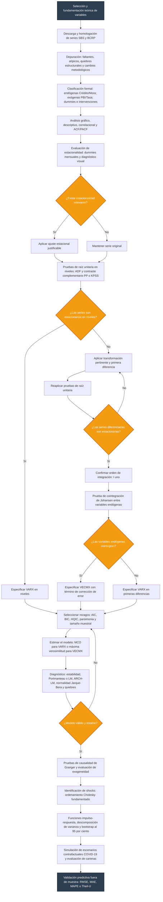

# Flujo metodológico VARX / VECMX

```mermaid
graph TD
    A["Selección y fundamentación teórica de variables"] --> B["Descarga y homologación de series SBS y BCRP"]
    B --> C["Depuración: faltantes, atípicos, quiebres estructurales y cambios metodológicos"]
    C --> D["Clasificación formal: endógenas Crédito/Mora; exógenas PBI/Tasa; dummies e intervenciones"]
    D --> E["Análisis gráfico, descriptivo, correlacional y ACF/PACF"]
    E --> F["Evaluación de estacionalidad: dummies mensuales y diagnóstico visual"]
    F --> G{"¿Existe estacionalidad relevante?"}

    G -- "Sí" --> H["Aplicar ajuste estacional justificable"]
    G -- "No" --> I["Mantener serie original"]

    H --> J["Pruebas de raíz unitaria en niveles: ADF y contraste complementario PP o KPSS"]
    I --> J

    J --> K{"¿Las series son estacionarias en niveles?"}

    K -- "Sí" --> L["Especificar VARX en niveles"]
    K -- "No" --> M["Aplicar transformación pertinente y primera diferencia"]

    M --> N["Reaplicar pruebas de raíz unitaria"]
    N --> O{"¿Las series diferenciadas son estacionarias?"}

    O -- "No" --> M
    O -- "Sí" --> P["Confirmar orden de integración: I uno"]

    P --> Q["Prueba de cointegración de Johansen entre variables endógenas"]
    Q --> R{"¿Las variables endógenas cointegran?"}

    R -- "Sí" --> S["Especificar VECMX con término de corrección de error"]
    R -- "No" --> T["Especificar VARX en primeras diferencias"]

    L --> U["Seleccionar rezagos: AIC, BIC, HQIC, parsimonia y tamaño muestral"]
    S --> U
    T --> U

    U --> V["Estimar el modelo: MCO para VARX o máxima verosimilitud para VECMX"]

    V --> W["Diagnóstico: estabilidad, Portmanteau o LM, ARCH-LM, normalidad Jarque-Bera y quiebres"]
    W --> X{"¿Modelo válido y estable?"}

    X -- "No" --> U
    X -- "Sí" --> Y["Pruebas de causalidad de Granger y evaluación de exogeneidad"]

    Y --> Z["Identificación de shocks: ordenamiento Cholesky fundamentado"]
    Z --> AA["Funciones impulso-respuesta, descomposición de varianza y bootstrap al 95 por ciento"]

    AA --> AB["Simulación de escenarios contrafactuales COVID-19 y evaluación de carteras"]
    AB --> AC["Validación predictiva fuera de muestra: RMSE, MAE, MAPE o Theil-U"]

    style A fill:#2c3e50,stroke:#1a252f,stroke-width:2px,color:#ffffff
    style AC fill:#2c3e50,stroke:#1a252f,stroke-width:2px,color:#ffffff

    style G fill:#f39c12,stroke:#d35400,stroke-width:2px,color:#ffffff
    style K fill:#f39c12,stroke:#d35400,stroke-width:2px,color:#ffffff
    style O fill:#f39c12,stroke:#d35400,stroke-width:2px,color:#ffffff
    style R fill:#f39c12,stroke:#d35400,stroke-width:2px,color:#ffffff
    style X fill:#f39c12,stroke:#d35400,stroke-width:2px,color:#ffffff
```