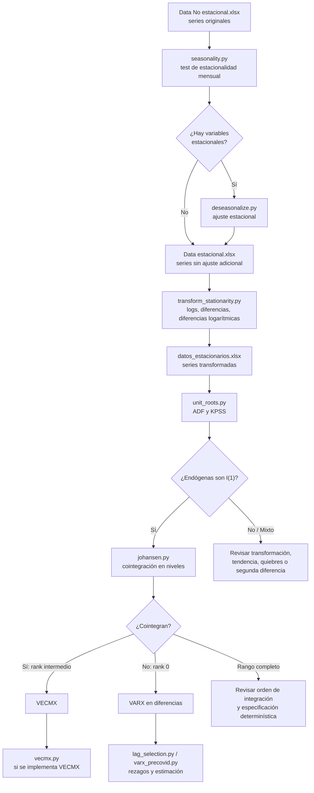

# Secuencia econométrica del proyecto

Esta guía resume **qué archivo ejecutar**, **qué archivo lee**, **qué archivo genera** y **cómo continuar** en cada etapa del flujo econométrico.

El objetivo aplicado del proyecto es analizar el comportamiento del volumen de créditos y la mora de las CMAC después del shock COVID-19, especialmente bajo escenarios contrafactuales relacionados con medidas de alivio o rescate.

---

## 0. Idea general del flujo



---

## 1. Convención de carpetas

| Carpeta | Uso |
|---|---|
| `data/` | Archivos Excel de entrada o datos base preparados. |
| `outputs/` | Resultados generados por los scripts. |
| `src/seasonality/` | Estacionalidad mensual y desestacionalización. |
| `src/unit_roots/` | Transformaciones y pruebas de raíz unitaria. |
| `src/cointegration/` | Prueba de Johansen. |
| `src/model/` | Selección de rezagos y estimación VARX/VECMX. |
| `src/scenarios/` | Baseline, contrafactuales y escenarios. |
| `src/shocks/` | Identificación de shocks e impulso-respuesta. |

---

## 2. Configuración central

Archivo:

```text
src/config/settings.py
```

Variables importantes:

```python
INPUT_FILE = "data/Data estacionaria.xlsx"
DATE_COL = "fecha"

ENDOG = ["D_ln_Vol_total", "D_Mora_total"]
ENDOG_LEVELS = ["Vol_total", "Mora_total"]

EXOG = ["D_ln_PBI_Desestacionalizado", "D_Tasa_Ref"]

SAMPLE_START = "2002-01-01"
SAMPLE_END = "2022-12-01"

TRAIN_START = SAMPLE_START
TRAIN_END = "2020-02-01"

SCENARIO_START = "2020-03-01"
SCENARIO_END = SAMPLE_END

SHOCK_MONTHS = ["2020-03-01", "2020-04-01"]

AID_START = "2020-05-01"
AID_END = "2022-11-01"

WINDOWS = {
    "full": (SAMPLE_START, SAMPLE_END),
    "pre_covid": (TRAIN_START, TRAIN_END),
    "scenario": (SCENARIO_START, SCENARIO_END),
    "aid": (AID_START, AID_END),
}

MAX_LAG = 12
```

Lectura:

- `ENDOG` contiene las variables que entran al VARX en diferencias.
- `ENDOG_LEVELS` contiene las variables endógenas en niveles asociadas.
- `SAMPLE_START` y `SAMPLE_END` delimitan la muestra completa disponible.
- `TRAIN_START` y `TRAIN_END` delimitan la ventana pre-COVID usada para estimar la dinámica normal.
- `SCENARIO_START` y `SCENARIO_END` delimitan el periodo donde se simulan contrafactuales.
- `SHOCK_MONTHS` define los meses usados para calibrar el shock inicial COVID.
- `AID_START` y `AID_END` delimitan la ventana tentativa de medidas de alivio/rescate; deben ajustarse cuando se defina la proxy final.
- `WINDOWS` permite que los scripts pidan ventanas por nombre mediante `slice_window(df, "pre_covid")`, `slice_window(df, "full")`, etc., sin escribir fechas directamente en cada archivo.
- Si `ENDOG` usa `D_ln_Vol_total`, la variable en nivel compatible para Johansen es `Ln_Vol_total`, no `Vol_total`.
- Si `ENDOG` usa `D_Mora_total`, la variable en nivel compatible es `Mora_total`.

> Nota de consistencia: en la carpeta `data/` pueden coexistir nombres como `Data estacional.xlsx`, `Data No estacional.xlsx`, `Data estacionaria.xlsx` y `datos_estacionarios.xlsx`. Antes de correr los scripts de modelo, verificar que `INPUT_FILE` apunte al Excel que realmente existe y que contiene las columnas transformadas (`D_ln_*`, `D_*`, `Ln_*`). Si no, actualizar `INPUT_FILE` o pasar el archivo con `--input` cuando el script lo permita.

---

## 3. Muestra: ¿pre-COVID o completa?

Esta decisión depende de la pregunta.

| Uso | Ventana recomendada | Motivo |
|---|---:|---|
| Decidir especificación del modelo | `2002-01` a `2020-02` | Captura la dinámica normal antes del quiebre COVID. |
| ADF/KPSS para el modelo contrafactual | `2002-01` a `2020-02` | Evita que el shock COVID contamine la decisión de estacionariedad. |
| Johansen | `2002-01` a `2020-02` | Evalúa relación de largo plazo antes del shock. |
| Selección de rezagos | `2002-01` a `2020-02` | El número de rezagos debe representar la dinámica normal. |
| Estimación del modelo normal | `2002-01` a `2020-02` | Sirve como base para simular escenarios. |
| Comparar observado vs escenario | `2020-03` a `2022-12` | Periodo de shock, medidas y recuperación. |
| Gráficos descriptivos | Muestra completa | Útil para narrar la historia completa. |

Nota importante: usar la muestra completa `2002-2022` no es inútil; sirve como diagnóstico de robustez o descripción. Pero si el objetivo es construir escenarios contrafactuales post-COVID, la especificación principal debe salir de la dinámica pre-COVID.

---

## 4. Etapa 1: test de estacionalidad mensual

### Script

```text
src/seasonality/seasonality.py
```

### Qué hace

Aplica una regresión con dummies mensuales:

```text
y_t = constante + tendencia_t + dummies_mensuales + error_t
```

La hipótesis nula es:

```text
H0: no existe estacionalidad mensual
```

Si `p_valor < 0.05`, se rechaza `H0` y la variable se clasifica como estacional.

### Lee

Actualmente el script apunta a:

```text
data/Data No estacionaria.xlsx
```

En el proyecto también aparecen archivos con nombres similares:

```text
data/Data No estacional.xlsx
data/Data estacional.xlsx
data/datos_estacionarios.xlsx
```

Antes de ejecutar, verificar que el nombre usado dentro del script coincida con el archivo real.

### Ejecutar

```bash
cd econometria-app
../.venv/bin/python src/seasonality/seasonality.py
```

### Genera

```text
outputs/resultados_estacionalidad.xlsx
```

### Cómo continuar

Abrir `outputs/resultados_estacionalidad.xlsx` y revisar la columna:

```text
es_estacional
```

Si alguna variable sale `"Sí"`, agregarla en `VARIABLES_ESTACIONALES` dentro de:

```text
src/seasonality/deseasonalize.py
```

Luego ejecutar la etapa 2.

---

## 5. Etapa 2: desestacionalización

### Script

```text
src/seasonality/deseasonalize.py
```

### Qué hace

Para las variables listadas en `VARIABLES_ESTACIONALES`, estima la componente estacional con el mismo modelo de dummies mensuales y genera una serie ajustada:

```text
y_t_SA = y_t - componente_estacional_t
```

### Lee

Actualmente apunta a:

```text
data/Data No estacionaria.xlsx
```

### Ejecutar

```bash
cd econometria-app
../.venv/bin/python src/seasonality/deseasonalize.py
```

### Genera

```text
outputs/datos_desestacionalizados.xlsx
```

Hojas:

| Hoja | Contenido |
|---|---|
| `Series_SA` | Series ajustadas estacionalmente. |
| `Resumen` | Resumen de componentes estacionales y R². |

### Cómo continuar

Si se decide reemplazar variables por sus versiones ajustadas, construir o actualizar el archivo:

```text
data/Data estacional.xlsx
```

Ese archivo debe ser el insumo de la etapa de transformación.

---

## 6. Etapa 3: transformar variables para estacionariedad

### Script

```text
src/unit_roots/transform_stationarity.py
```

### Qué hace

Genera transformaciones usuales:

| Tipo de variable | Transformación | Interpretación |
|---|---|---|
| Volúmenes de crédito | `Ln_*` y `D_ln_*` | Nivel logarítmico y crecimiento aproximado. |
| PBI | `Ln_PBI_*` y `D_ln_PBI_*` | Nivel logarítmico y crecimiento aproximado. |
| Mora | `D_Mora_*` | Cambio mensual de la mora. |
| Tasa de referencia | `D_Tasa_Ref` | Cambio mensual de la tasa. |

Variables configuradas:

```python
VARIABLES_LOG_DIFF = [
    "Vol_comerciales",
    "Vol_consumo",
    "Vol_hipotecarios",
    "Vol_microcreditos",
    "Vol_total",
    "PBI_Desestacionalizado",
]

VARIABLES_DIFF = [
    "Mora_comerciales",
    "Mora_consumo",
    "Mora_hipotecarios",
    "Mora_microcreditos",
    "Mora_total",
    "Tasa_Ref",
]
```

### Lee

Actualmente:

```text
data/Data estacional.xlsx
```

### Ejecutar

```bash
cd econometria-app
../.venv/bin/python src/unit_roots/transform_stationarity.py
```

Opcional, para eliminar la primera fila que queda con `NaN` por la diferencia:

```bash
../.venv/bin/python src/unit_roots/transform_stationarity.py --dropna
```

### Genera

```text
outputs/datos_transformados_estacionarios.xlsx
```

Hojas:

| Hoja | Contenido |
|---|---|
| `Datos_transformados` | Datos originales + logs + diferencias. |
| `Resumen_transformaciones` | Qué columna se creó para cada variable. |

### Cómo continuar

Usar este archivo para las pruebas ADF/KPSS de la etapa 4. Si se quiere que el resto del proyecto lo tome como archivo base, copiarlo o guardarlo como:

```text
data/datos_estacionarios.xlsx
```

o ajustar `INPUT_FILE` en:

```text
src/config/settings.py
```

---

## 7. Etapa 4: pruebas de raíz unitaria ADF y KPSS

### Script

```text
src/unit_roots/unit_roots.py
```

### Qué hace

Aplica dos pruebas:

| Prueba | Hipótesis nula | Regla práctica |
|---|---|---|
| ADF | La serie tiene raíz unitaria; no es estacionaria. | `p < 0.05` sugiere estacionariedad. |
| KPSS | La serie es estacionaria. | `p < 0.05` sugiere no estacionariedad. |

Clasificación del script:

| Resultado | Lectura |
|---|---|
| `Sí` | ADF y KPSS son consistentes con estacionariedad. |
| `No` | ADF y KPSS son consistentes con no estacionariedad. |
| `Mixta` | Las pruebas se contradicen; revisar tendencia, quiebres o especificación. |

### Lee

Actualmente:

```text
data/datos_estacionarios.xlsx
```

y la hoja:

```text
Datos_transformados
```

### Ejecutar

Todas las variables:

```bash
cd econometria-app
../.venv/bin/python src/unit_roots/unit_roots.py
```

Solo variables transformadas:

```bash
../.venv/bin/python src/unit_roots/unit_roots.py --solo-transformadas
```

Con otro archivo de entrada:

```bash
../.venv/bin/python src/unit_roots/unit_roots.py \
  --input outputs/datos_transformados_estacionarios.xlsx \
  --output outputs/resultados_raiz_unitaria.xlsx
```

### Genera

```text
outputs/resultados_raiz_unitaria_de_datos_transformados.xlsx
```

Hojas:

| Hoja | Contenido |
|---|---|
| `Resumen` | Variable, p-valores, decisión y clasificación. |
| `Detalle_ADF_KPSS` | Estadísticos, rezagos y valores críticos de cada prueba. |

### Cómo continuar

Para cada variable endógena del modelo:

| Si ocurre | Acción |
|---|---|
| Nivel no estacionario y diferencia estacionaria | Tratar la variable como `I(1)`. |
| Diferencia sale `Mixta` | Revisar con tendencia, quiebre COVID o muestra pre-COVID. |
| Diferencia no estacionaria | Evaluar segunda diferencia solo como último recurso. |
| Nivel ya estacionario | Podría usarse en niveles; si el modelo está en variaciones, documentar por qué se diferencia. |

Para el VARX agregado actual se espera trabajar con:

```text
D_ln_Vol_total
D_Mora_total
```

Y para los sistemas sectoriales:

```text
D_ln_Vol_comerciales, D_Mora_comerciales
D_ln_Vol_consumo, D_Mora_consumo
D_ln_Vol_hipotecarios, D_Mora_hipotecarios
D_ln_Vol_microcreditos, D_Mora_microcreditos
```

---

## 8. Etapa 5: confirmar orden de integración

Esta etapa no siempre es un script separado; se deriva de la etapa 4.

Ejemplo:

```text
Vol_total no estacionaria en niveles
D_ln_Vol_total estacionaria
=> Ln_Vol_total es I(1)
```

```text
Mora_total no estacionaria en niveles
D_Mora_total estacionaria
=> Mora_total es I(1)
```

La frase correcta no es:

> Las variables cointegran en primera diferencia.

La frase correcta es:

> Las variables en niveles son integradas de orden uno, I(1), porque sus primeras diferencias son estacionarias.

Solo después de confirmar `I(1)` tiene sentido aplicar Johansen.

---

## 9. Etapa 6: cointegración de Johansen

### Script

```text
src/cointegration/johansen.py
```

### Qué hace

Aplica la prueba de Johansen sobre las variables endógenas en niveles.

Importante:

```text
Johansen NO se aplica sobre D_ln_* ni sobre D_*.
```

Si en `settings.py` se tiene:

```python
ENDOG = ["D_ln_Vol_total", "D_Mora_total"]
ENDOG_LEVELS = ["Vol_total", "Mora_total"]
```

el script usa:

```text
Ln_Vol_total
Mora_total
```

porque `D_ln_Vol_total` proviene de `Ln_Vol_total`.

### Lee

Por defecto busca:

```text
data/Data estacionaria.xlsx
data/datos_estacionarios.xlsx
```

según disponibilidad.

### Ejecutar modelo agregado

```bash
cd econometria-app
../.venv/bin/python src/cointegration/johansen.py
```

### Ejecutar un sistema sectorial

Comerciales:

```bash
../.venv/bin/python src/cointegration/johansen.py \
  --vars Ln_Vol_comerciales Mora_comerciales \
  --output outputs/resultados_johansen_comerciales.xlsx
```

Consumo:

```bash
../.venv/bin/python src/cointegration/johansen.py \
  --vars Ln_Vol_consumo Mora_consumo \
  --output outputs/resultados_johansen_consumo.xlsx
```

Hipotecarios:

```bash
../.venv/bin/python src/cointegration/johansen.py \
  --vars Ln_Vol_hipotecarios Mora_hipotecarios \
  --output outputs/resultados_johansen_hipotecarios.xlsx
```

Microcréditos:

```bash
../.venv/bin/python src/cointegration/johansen.py \
  --vars Ln_Vol_microcreditos Mora_microcreditos \
  --output outputs/resultados_johansen_microcreditos.xlsx
```

### Opciones importantes

Cambiar supuesto determinístico:

```bash
../.venv/bin/python src/cointegration/johansen.py --det-order 1
```

Interpretación:

| `det_order` | Lectura |
|---:|---|
| `-1` | Sin constante. |
| `0` | Constante. |
| `1` | Tendencia lineal. |

Cambiar rezagos en diferencias:

```bash
../.venv/bin/python src/cointegration/johansen.py --k-ar-diff 2
```

### Genera

```text
outputs/resultados_johansen.xlsx
```

Hojas:

| Hoja | Contenido |
|---|---|
| `Resumen` | Rank, decisión VARX/VECMX y comentario. |
| `Detalle_Johansen` | Estadísticos trace y max-eigen contra críticos. |
| `Eigenvalues` | Valores propios del test. |

### Cómo decidir

Si hay `n` variables endógenas:

| Rank | Decisión |
|---:|---|
| `0` | No cointegran; usar VARX en diferencias. |
| `0 < rank < n` | Cointegran; considerar VECMX. |
| `rank = n` | Rango completo; revisar orden de integración o especificación determinística. |

Con dos variables:

```text
rank = 0 -> VARX en diferencias
rank = 1 -> VECMX
rank = 2 -> revisar; no es cointegración normal
```

---

## 10. ¿Debo hacer Johansen para comerciales, consumo, hipotecarios y microcréditos?

Depende del modelo que se va a estimar.

### Si el modelo es agregado

Endógenas:

```text
D_ln_Vol_total
D_Mora_total
```

Johansen debe hacerse solo sobre:

```text
Ln_Vol_total
Mora_total
```

No corresponde incluir comerciales, consumo, hipotecarios y microcréditos en el Johansen agregado porque esas variables no componen ese sistema.

### Si se estiman modelos sectoriales

Entonces sí corresponde hacer Johansen por cada sistema:

| Sistema | Variables en diferencias | Variables para Johansen |
|---|---|---|
| Comerciales | `D_ln_Vol_comerciales`, `D_Mora_comerciales` | `Ln_Vol_comerciales`, `Mora_comerciales` |
| Consumo | `D_ln_Vol_consumo`, `D_Mora_consumo` | `Ln_Vol_consumo`, `Mora_consumo` |
| Hipotecarios | `D_ln_Vol_hipotecarios`, `D_Mora_hipotecarios` | `Ln_Vol_hipotecarios`, `Mora_hipotecarios` |
| Microcréditos | `D_ln_Vol_microcreditos`, `D_Mora_microcreditos` | `Ln_Vol_microcreditos`, `Mora_microcreditos` |

Esto sí responde al objetivo específico de identificar respuestas diferenciadas por tipo de crédito.

---

## 11. Etapa 7: selección de rezagos

### Script

```text
src/model/lag_selection.py
```

### Qué hace

Calcula criterios de información para distintos rezagos:

```text
AIC
BIC
```

### Lee

Usa:

```text
INPUT_FILE
ENDOG
EXOG
MAX_LAG
```

desde:

```text
src/config/settings.py
```

### Ejecutar

```bash
cd econometria-app
../.venv/bin/python src/model/lag_selection.py
```

### Genera

Actualmente imprime tabla en consola. No guarda Excel por defecto.

### Cómo continuar

Usar la tabla como referencia, pero no decidir solo por AIC/BIC. Contrastar con:

```text
estabilidad del VARX
ruido blanco en residuos
parsimonia
sentido económico
```

---

## 12. Etapa 8: estimación VARX pre-COVID

### Script

```text
src/model/varx_precovid.py
```

### Qué hace

Estima el VARX con muestra pre-COVID:

```python
df_pre = df_all.loc["2002-01-01":"2020-02-01"]
```

Evalúa candidatos:

```python
p_candidates = [1, 3, 6, 12]
```

y elige el primer `p` que cumpla:

```text
estabilidad + Ljung-Box con p-value > 0.05
```

### Lee

Desde `settings.py`:

```text
INPUT_FILE
ENDOG
EXOG
```

### Ejecutar

```bash
cd econometria-app
../.venv/bin/python src/model/varx_precovid.py
```

### Genera

Actualmente imprime en consola:

```text
p elegido
estabilidad
Ljung-Box
ENDOG
EXOG
```

No guarda Excel por defecto.

### Cómo continuar

Si el modelo es estable y los residuos se comportan razonablemente como ruido blanco:

```text
continuar con shocks, baseline y escenarios
```

Si no:

```text
revisar rezagos, variables, ventana o transformaciones
```

---

## 13. Etapa 9: diagnóstico del VARX

### Archivo base

```text
src/diagnostics/diagnostics.py
```

### Funciones importantes

| Función | Qué hace |
|---|---|
| `estimate_varx_ols(df, p)` | Estima cada ecuación del VARX por OLS. |
| `stability_roots(A_list)` | Calcula raíces de estabilidad. |
| `residual_diagnostics(resid, lags=12)` | Aplica Ljung-Box a residuos. |

### Regla práctica

| Diagnóstico | Criterio |
|---|---|
| Estabilidad | raíces con módulo menor que 1. |
| Ljung-Box | p-value mayor que 0.05 sugiere ausencia de autocorrelación. |

---

## 14. Etapa 10: baseline, shock y escenarios

Estos scripts dependen de la decisión anterior: VARX en diferencias o VECMX.

Si la decisión fue VARX en diferencias, el proyecto continúa con scripts como:

```text
src/scenarios/baseline.py
src/scenarios/counterfactual_covid.py
src/scenarios/counterfactual_independent.py
src/scenarios/counterfactual_not_independent.py
src/scenarios/escenarios_macro.py
src/shocks/shock_pbi.py
src/shocks/irf.py
```

La idea conceptual:

| Escenario | Qué representa |
|---|---|
| Baseline normal | Trayectoria estimada con dinámica pre-COVID. |
| Observado | Lo que realmente ocurrió. |
| COVID con ayuda | Escenario que conserva shock y medidas observadas. |
| COVID sin ayuda | Contrafactual relevante si se introduce una variable/proxy de medidas gubernamentales. |
| Escenarios alternativos | Cambios hipotéticos en PBI, tasa, shock o política. |

Nota clave: si el objetivo es analizar un escenario **sin medidas de alivio**, se necesita representar dichas medidas en el modelo. Puede ser con:

```text
dummy de alivio
monto de programas
cartera reprogramada
intensidad de garantías
proxy temporal de política
```

Sin esa variable o proxy, el contrafactual debe redactarse con cautela como un escenario bajo supuestos, no como una identificación causal fuerte.

---

## 15. Checklist rápido de ejecución

### 1. Estacionalidad

```bash
cd econometria-app
../.venv/bin/python src/seasonality/seasonality.py
```

Revisar:

```text
outputs/resultados_estacionalidad.xlsx
```

### 2. Desestacionalización, si aplica

Editar `VARIABLES_ESTACIONALES` y ejecutar:

```bash
../.venv/bin/python src/seasonality/deseasonalize.py
```

Revisar:

```text
outputs/datos_desestacionalizados.xlsx
```

### 3. Transformaciones

```bash
../.venv/bin/python src/unit_roots/transform_stationarity.py
```

Revisar:

```text
outputs/datos_transformados_estacionarios.xlsx
```

### 4. Raíz unitaria

```bash
../.venv/bin/python src/unit_roots/unit_roots.py --solo-transformadas
```

Revisar:

```text
outputs/resultados_raiz_unitaria_de_datos_transformados.xlsx
```

### 5. Johansen agregado

```bash
../.venv/bin/python src/cointegration/johansen.py
```

Revisar:

```text
outputs/resultados_johansen.xlsx
```

### 6. Johansen sectorial, si se harán modelos por tipo de crédito

```bash
../.venv/bin/python src/cointegration/johansen.py --vars Ln_Vol_comerciales Mora_comerciales --output outputs/resultados_johansen_comerciales.xlsx
../.venv/bin/python src/cointegration/johansen.py --vars Ln_Vol_consumo Mora_consumo --output outputs/resultados_johansen_consumo.xlsx
../.venv/bin/python src/cointegration/johansen.py --vars Ln_Vol_hipotecarios Mora_hipotecarios --output outputs/resultados_johansen_hipotecarios.xlsx
../.venv/bin/python src/cointegration/johansen.py --vars Ln_Vol_microcreditos Mora_microcreditos --output outputs/resultados_johansen_microcreditos.xlsx
```

### 7. Rezagos

```bash
../.venv/bin/python src/model/lag_selection.py
```

### 8. VARX pre-COVID

```bash
../.venv/bin/python src/model/varx_precovid.py
```

---

## 16. Tabla resumen: archivo usado, archivo generado y siguiente paso

| Etapa | Script | Lee | Genera | Siguiente paso |
|---:|---|---|---|---|
| 1 | `src/seasonality/seasonality.py` | `data/Data No estacionaria.xlsx` | `outputs/resultados_estacionalidad.xlsx` | Ver qué variables tienen `es_estacional = Sí`. |
| 2 | `src/seasonality/deseasonalize.py` | `data/Data No estacionaria.xlsx` | `outputs/datos_desestacionalizados.xlsx` | Construir/actualizar `data/Data estacional.xlsx`. |
| 3 | `src/unit_roots/transform_stationarity.py` | `data/Data estacional.xlsx` | `outputs/datos_transformados_estacionarios.xlsx` | Usar transformadas para ADF/KPSS. |
| 4 | `src/unit_roots/unit_roots.py` | `data/datos_estacionarios.xlsx` o archivo indicado por `--input` | `outputs/resultados_raiz_unitaria_de_datos_transformados.xlsx` | Confirmar `I(1)` en endógenas. |
| 5 | `src/cointegration/johansen.py` | `data/datos_estacionarios.xlsx` o archivo detectado | `outputs/resultados_johansen.xlsx` | Decidir VARX en diferencias o VECMX. |
| 6 | `src/model/lag_selection.py` | `INPUT_FILE` de `settings.py` | Consola | Elegir rezago candidato. |
| 7 | `src/model/varx_precovid.py` | `INPUT_FILE` de `settings.py` | Consola | Validar estabilidad y residuos. |
| 8 | `src/scenarios/*.py` | Modelo y datos transformados | Escenarios / gráficos / reportes | Comparar observado vs contrafactual. |

---

## 17. Reglas de decisión para escribir en la tesis

### Estacionalidad mensual

> Se aplicó una regresión con dummies mensuales y tendencia determinística. La estacionalidad se evaluó mediante una prueba F conjunta sobre las dummies mensuales.

### Estacionariedad

> La estacionariedad se evaluó mediante ADF y KPSS. Se consideró evidencia fuerte de estacionariedad cuando ADF rechazó la hipótesis de raíz unitaria y KPSS no rechazó la hipótesis de estacionariedad.

### Orden de integración

> Una serie se clasificó como I(1) cuando no fue estacionaria en niveles, pero su primera diferencia o primera diferencia logarítmica sí presentó estacionariedad.

### Cointegración

> La prueba de Johansen se aplicó sobre las variables endógenas en niveles. Si el rango de cointegración fue cero, se mantuvo un VARX en primeras diferencias. Si el rango fue intermedio, se consideró un VECMX. Si el rango fue completo, se revisó la hipótesis de integración y la especificación determinística.

### Modelo agregado vs modelos sectoriales

> El modelo agregado evalúa `Vol_total` y `Mora_total`. Para identificar respuestas diferenciadas por tipo de crédito, se estiman sistemas sectoriales separados para comerciales, consumo, hipotecarios y microcréditos.
